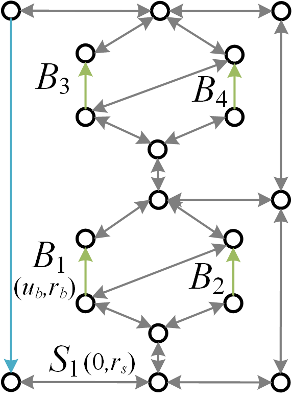
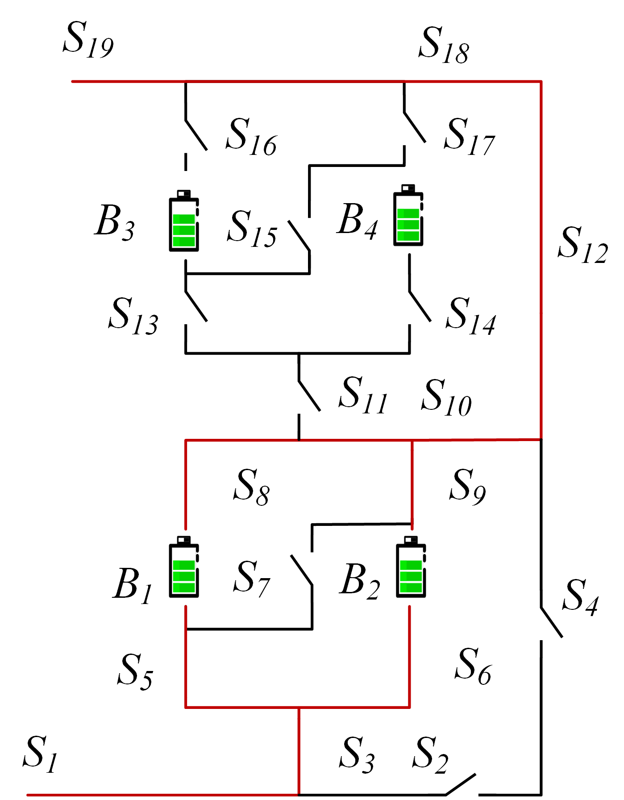

title: 一种可重构电池系统最大许用电流计算方法

# 权利要求书

1. 一种可重构电池系统最大许用电流计算方法，其特征在于，包括以下步骤：

**步骤1：** 设待求解的可重构电池系统中电池数量为$N_b$，开关数量为$N_s$。基于该系统的电池和开关连接关系，构建具有物理信息的有向图模型。

**步骤2：** 根据步骤1中构建的有向图模型，以开关状态为变量，各电池流经电流不超过电池许用电流为约束条件，系统输出电流为目标函数，建立优化模型。

**步骤3：** 基于步骤1中构建的有向图模型，对其中的$N_b$个电池分别求解对应的最短通路，其中通路$p$的距离通过下式计算得到：
$$
   \omega(p) = N_s \cdot n_b (p) + n_s (p),
$$
其中，$n_b$为通路中电池数量，$n_s$为通路中开关的数量。

**步骤4：** 设选取的最短通路数量为$N_{set}$，其初始值为$N_b$。

**步骤5：** 从步骤3中求解得到的$N_b$条最短通路中组合选取$N_{set}$条通路，生成$C^{N_{set}}_{N_b}$种组合方式。

**步骤6：** 对步骤5中生成的每一种组合方式，将被选入通路的开关状态设置为闭合，其余开关状态设置为断开，带入步骤2中建立的优化模型，判断是否满足约束条件。若满足，则该组合方式下的系统输出电流；否则舍弃。

**步骤7：** 从步骤6中满足约束条件的组合方式中，选取输出电流最大的组合方式，记录此时的系统最大许用电流值。

**步骤8：** 使用如下规则更新步骤4中的$N_{set}$的值，重复步骤5至步骤8：
- 若当前系统最大许用电流值为第一次记录，则使用$N_{set}/2$的最近整数值更新$N_{set}$的值；
- 若当前系统最大许用电流值大于前一次系统许用电流值，则使用二分法向上更新整数$N_{set}$的值；
- 若当前系统最大许用电流值等于前一次系统许用电流值，则终止计算，输出系统最大许用电流值；
- 若当前系统最大许用电流值小于前一次系统许用电流值，则使用二分法向下更新整数$N_{set}$的值。

2. 如权利要求1所述的可重构电池系统最大许用电流计算方法，其特征在于，所述步骤1中的“基于该系统的电池和开关连接关系，构建具有物理信息的有向图模型”进一步包括以下内容：

- 该有向图模型中的节点对应实际可重构电池系统中组件（即电池和开关）之间的连接点。
- 该有向图模型中的边对应实际可重构电池系统中的电池、开关和外部负载。其中电池用从电池负极指向电池正极的有向边表示；开关用一对方向相反的有向边表示；外部负载用从系统正极指向负极的有向边表示。
- 该有向图模型中的边都被分配了两个属性，电压差和电阻。

3. 如权利要求1所述的可重构电池系统最大许用电流计算方法，其特征在于，所述步骤2中的“根据步骤1中构建的有向图模型，以开关状态为变量，各电池流经电流不超过电池许用电流为约束条件，系统输出电流为目标函数，建立优化模型”进一步包括以下内容：

**步骤21：** 根据**步骤1**中构建的有向图模型，按以下关系确定关联矩阵$A$：
$$
   a_{kl}=
   \begin{cases}
      1,  & \text{边$l$离开节点$k$},\\
      -1, & \text{边$l$进入节点$k$},\\
      0,  & \text{其他}.
   \end{cases}
$$

**步骤22：** 根据有向图模型中每个有向边的具体含义，对关联矩阵按列进行归类整理。将其中表示开关的列，以互为相反的两列为一组，每组仅保留一列；删去所有列的最后一行，得到简化关联矩阵$\tilde{A}=[\tilde{A}_b\,\tilde{A}_s\,\tilde{A}_o]$。其中，$\tilde{A}_b$，$\tilde{A}_s$和$\tilde{A}_o$分别对应电池、开关和外部负载。

**步骤23：** 设系统中$N_s$个开关的状态为$X_s$，是一个$N_s$阶方阵，其对角线上的元素为1或0，分别表示开关闭合或断开；其非对角线上的元素均为0。

**步骤24：** 系统中$N_b$个电池的电流用下式计算得到：
$$
   I_b = \frac{1}{r_b^2}[\tilde{A}_b^\mathrm{T} Y_n^{-1}(X_s) \tilde{A}_b U_b -r_b U_b],
$$
其中，$I_b$为电池电流，$r_b$为电池内阻，$U_b$为电池电压，$I_{b,\mathrm{max}}$为电池最大许用电流，$Y_n(X_s)$为系统节点电导矩阵，其通过下式计算得到：
$$
Y_n (X_s) = \frac{1}{R_o} \tilde{A}_o\tilde{A}_o^\mathrm{T} + \frac{1}{r_b} \tilde{A}_b \tilde{A}_b^\mathrm{T} + \frac{1}{r_s}\tilde{A}_s X_s \tilde{A}_s^\mathrm{T}.
$$
其中，$R_o$为外部负载电阻，$r_s$为开关内阻。

**步骤25：** 系统的输出电流用下式计算得到：
$$
I_b = \frac{1}{r_b^2}[\tilde{A}_b^\mathrm{T} Y_n^{-1}(X_s) \tilde{A}_b U_b -r_b U_b].
$$

**步骤26：** 基于**步骤24**和**步骤25**，最终得到如下形式的优化模型：
$$
\mathrm{max} I(X_s)
$$

$$
\text{s.t.} \mathrm{max} (I_b) \leq I_{b,\mathrm{max}}.
$$

# 说明书

## 所属技术领域

本发明提出一种可重构电池系统最大许用电流计算方法，属于电池管理系统领域。

## 背景技术

可重构电池系统以其灵活的电路拓扑结构和高可靠性而受到越来越多的关注。
在可重构电池系统中，电池和开关形成的复杂连接结构为设计和控制提供了灵活性，但也带来了挑战。
与固定输出的传统电池储能系统不同，可重构电池系统的输出通过控制开关状态来动态调整，以满足外部负载需求。
错误的开关控制策略可能导致电池短路或过载，从而危及整个系统。
最大允许电流是可重构电池系统性能指标，可以指导设计人员解决这个问题。
当前，可重构电池系统的最大允许电流通常通过手动计算得到，这种方法耗时且容易出错，无法满足实际应用的需求。
因此，迫切需要一种通用且自动计算可重构电池系统最大允许电流的方法。

## 发明内容

为解决现有技术中可重构电池系统最大许用电流计算方法耗时且容易出错的问题，本发明提出一种可重构电池系统最大许用电流计算方法，能够自动计算可重构电池系统最大许用电流，具有通用性。

一种可重构电池系统最大许用电流计算方法，具体包括如下步骤：

**第一步：** 设待求解的可重构电池系统中电池数量为$N_b$，开关数量为$N_s$。基于该系统的电池和开关连接关系，构建具有物理信息的有向图模型。
该有向图模型中的节点对应实际可重构电池系统中组件（即电池和开关）之间的连接点。
模型中的边对应实际可重构电池系统中的电池、开关和外部负载。其中电池用从电池负极指向电池正极的有向边表示；开关用一对方向相反的有向边表示；外部负载用从系统正极指向负极的有向边表示。
模型中的边都被分配了两个属性，电压差和电阻。

**第二步：** 根据第一步中构建的有向图模型，以开关状态为变量，各电池流经电流不超过电池许用电流为约束条件，系统输出电流为目标函数，建立优化模型。
首先，根据**第一步**中构建的有向图模型，按以下关系确定关联矩阵$A$：
$$
   a_{kl}=
   \begin{cases}
      1,  & \text{边$l$离开节点$k$},\\
      -1, & \text{边$l$进入节点$k$},\\
      0,  & \text{其他}.
   \end{cases}
$$
其次，根据有向图模型中每个有向边的具体含义，对关联矩阵按列进行归类整理。将其中表示开关的列，以互为相反的两列为一组，每组仅保留一列；删去所有列的最后一行，得到简化关联矩阵$\tilde{A}=[\tilde{A}_b\,\tilde{A}_s\,\tilde{A}_o]$。其中，$\tilde{A}_b$，$\tilde{A}_s$和$\tilde{A}_o$分别对应电池、开关和外部负载。
接着，设系统中$N_s$个开关的状态为$X_s$，是一个$N_s$阶方阵，其对角线上的元素为1或0，分别表示开关闭合或断开；其非对角线上的元素均为0。
然后，系统中$N_b$个电池的电流用下式计算得到：
$$
   I_b = \frac{1}{r_b^2}[\tilde{A}_b^\mathrm{T} Y_n^{-1}(X_s) \tilde{A}_b U_b -r_b U_b],
$$
其中，$r_b$为电池内阻，$U_b$为电池电压，$I_{b,\mathrm{max}}$为电池最大许用电流，$Y_n(X_s)$为系统节点电导矩阵，其通过下式计算得到：
$$
Y_n (X_s) = \frac{1}{R_o} \tilde{A}_o\tilde{A}_o^\mathrm{T} + \frac{1}{r_b} \tilde{A}_b \tilde{A}_b^\mathrm{T} + \frac{1}{r_s}\tilde{A}_s X_s \tilde{A}_s^\mathrm{T}.
$$
其中，$R_o$为外部负载电阻，$r_s$为开关内阻。
系统的输出电流用下式计算得到：
$$
I_b = \frac{1}{r_b^2}[\tilde{A}_b^\mathrm{T} Y_n^{-1}(X_s) \tilde{A}_b U_b -r_b U_b].
$$
最后，得到如下形式的优化模型：
$$
\mathrm{max} I(X_s)
$$

$$
\text{s.t.} \mathrm{max} (I_b) \leq I_{b,\mathrm{max}}.
$$

**第三步：** 基于第一步中构建的有向图模型，对其中的$N_b$个电池分别求解对应的最短通路，其中通路$p$的距离通过下式计算得到：
$$
\omega(p) = N_s \cdot n_b (p) + n_s (p),
$$
其中，$n_b$为通路中电池数量，$n_s$为通路中开关的数量。

**第四步：** 设选取的最短通路数量为$N_{set}$，其初始值为$N_b$。

**第五步：** 从第三步中求解得到的$N_b$条最短通路中组合选取$N_{set}$条通路，生成$C^{N_{set}}_{N_b}$种组合方式。

**第六步：** 对第五步中生成的每一种组合方式，将被选入通路的开关状态设置为闭合，其余开关状态设置为断开，带入第二步中建立的优化模型，判断是否满足约束条件。若满足，则该组合方式下的系统输出电流；否则舍弃。

**第七步：** 从第六步中满足约束条件的组合方式中，选取输出电流最大的组合方式，记录此时的系统最大许用电流值和开关闭合方式。

**第八步：** 使用如下规则更新第四步中的$N_{set}$的值，重复第五步至第八步：
- 若当前系统最大许用电流值为第一次记录，则使用$N_{set}/2$的最近整数值更新$N_{set}$的值；
- 若当前系统最大许用电流值大于前一次系统许用电流值，则使用二分法向上更新整数$N_{set}$的值；
- 若当前系统最大许用电流值等于前一次系统许用电流值，则终止计算，输出系统最大许用电流值；
- 若当前系统最大许用电流值小于前一次系统许用电流值，则使用二分法向下更新整数$N_{set}$的值。

## 附图说明

图1为本发明实施例的可重构电池系统最大许用电流计算方法的步骤流程图。

图2为本发明实施例的待求解可重构电池系统的电路图。

图3为本发明实施例的可重构电池系统最大许用电流计算过程中的具有物理信息的有向图模型。

图4为本发明实施例的可重构电池系统最大许用电流计算过程中的最短通路求解结果。

图5为本发明实施例的可重构电池系统最大许用电流计算的计算结果。

## 具体实施方式

下面结合附图说明及具体实施案例对本发明提出的可重构电池系统最大许用电流计算方法进行进一步说明。

如图1所示，一种可重构电池系统最大许用电流计算方法，包括以下步骤：

S1. 本实施例中，以图2所示的具有4个电池和19个开关的可重构电池系统为计算对象，即$N_b=4$，$N_s=19$。
以实际可重构电池系统中组件（即电池和开关）之间的连接点为节点，以实际可重构电池系统中的电池、开关和外部负载为边，且条边上被分配电压差和电阻两个属性，构建具有物理信息的有向图模型，如图3所示。

S2. 根据图3所建立的具有物理信息的有向图模型，简化关联矩阵$\tilde{A}$为：
$$
\tilde{A}=[\tilde{A}_b\,\tilde{A}_s\,\tilde{A}_o],
$$
$$
\tilde{A}_b=
\begin{pmatrix}
   0  &  0  &  0  &  0  &  1  &  0  & -1  &  0  &  0  &  0  &  0  &  0  &  0  &  0  &  0  &  0  &  0 \\
   0  &  0  &  0  &  0  &  0  &  1  &  0  & -1  &  0  &  0  &  0  &  0  &  0  &  0  &  0  &  0  &  0 \\
   0  &  0  &  0  &  0  &  0  &  0  &  0  &  0  &  0  &  0  &  0  &  1  &  0  & -1  &  0  &  0  &  0 \\
   0  &  0  &  0  &  0  &  0  &  0  &  0  &  0  &  0  &  0  &  0  &  0  &  1  &  0  & -1  &  0  &  0 \\
\end{pmatrix} ^ \text{T},
$$
$$
\tilde{A}_s=
\begin{pmatrix}
    1  &  0  &  0  &  0  &  0  &  0  &  0  &  0  &  0  &  0  &  0  &  0  &  0  &  0  &  0  &  0  &  0  &  0  &  0 \\
   -1  &  1  &  1  &  0  &  0  &  0  &  0  &  0  &  0  &  0  &  0  &  0  &  0  &  0  &  0  &  0  &  0  &  0  &  0 \\
    0  & -1  &  0  &  1  &  0  &  0  &  0  &  0  &  0  &  0  &  0  &  0  &  0  &  0  &  0  &  0  &  0  &  0  &  0 \\
    0  &  0  & -1  &  0  &  1  &  1  &  0  &  0  &  0  &  0  &  0  &  0  &  0  &  0  &  0  &  0  &  0  &  0  &  0 \\
    0  &  0  &  0  &  0  & -1  &  0  &  1  &  0  &  0  &  0  &  0  &  0  &  0  &  0  &  0  &  0  &  0  &  0  &  0 \\
    0  &  0  &  0  &  0  &  0  & -1  &  0  &  0  &  0  &  0  &  0  &  0  &  0  &  0  &  0  &  0  &  0  &  0  &  0 \\
    0  &  0  &  0  &  0  &  0  &  0  &  0  &  1  &  0  &  0  &  0  &  0  &  0  &  0  &  0  &  0  &  0  &  0  &  0 \\
    0  &  0  &  0  &  0  &  0  &  0  & -1  &  0  &  1  &  0  &  0  &  0  &  0  &  0  &  0  &  0  &  0  &  0  &  0 \\
    0  &  0  &  0  &  0  &  0  &  0  &  0  & -1  & -1  &  1  &  1  &  0  &  0  &  0  &  0  &  0  &  0  &  0  &  0 \\
    0  &  0  &  0  & -1  &  0  &  0  &  0  &  0  &  0  & -1  &  0  &  1  &  0  &  0  &  0  &  0  &  0  &  0  &  0 \\
    0  &  0  &  0  &  0  &  0  &  0  &  0  &  0  &  0  &  0  & -1  &  0  &  1  &  1  &  0  &  0  &  0  &  0  &  0 \\
    0  &  0  &  0  &  0  &  0  &  0  &  0  &  0  &  0  &  0  &  0  &  0  & -1  &  0  &  1  &  0  &  0  &  0  &  0 \\
    0  &  0  &  0  &  0  &  0  &  0  &  0  &  0  &  0  &  0  &  0  &  0  &  0  & -1  &  0  &  0  &  0  &  0  &  0 \\
    0  &  0  &  0  &  0  &  0  &  0  &  0  &  0  &  0  &  0  &  0  &  0  &  0  &  0  &  0  &  1  &  0  &  0  &  0 \\
    0  &  0  &  0  &  0  &  0  &  0  &  0  &  0  &  0  &  0  &  0  &  0  &  0  &  0  & -1  &  0  &  1  &  0  &  0 \\
    0  &  0  &  0  &  0  &  0  &  0  &  0  &  0  &  0  &  0  &  0  &  0  &  0  &  0  &  0  & -1  & -1  &  1  &  1 \\
    0  &  0  &  0  &  0  &  0  &  0  &  0  &  0  &  0  &  0  &  0  & -1  &  0  &  0  &  0  &  0  &  0  & -1  &  0 \\
\end{pmatrix},
$$
$$
\tilde{A}_o=
\begin{pmatrix}
    -1  &  0  &  0  &  0  &  0  &  0  &  0  &  0  &  0  &  0  &  0  &  0  &  0  &  0  &  0  &  0  &  0
\end{pmatrix} ^\text{T},
$$
设系统中$N_s$个开关的状态为$X_s$，是一个$N_s$阶方阵，其对角线上的元素为1或0，分别表示开关闭合或断开；其非对角线上的元素均为0。
在本示例中，系统中电池的内阻$r_b=50\,\mathrm{m\Omega}$，外部负载的电阻$R_o=2\,\Omega$，开关的内阻为$r_s=0.1\,\mathrm{m\Omega}$，电池最大寻用电流$I_{b,\mathrm{max}}=5\,\mathrm{A}$，电池电压$U_b=3.6\,\mathrm{V}$。
系统中$N_b$个电池的电流用下式计算得到：
$$
   I_b = \frac{1}{r_b^2}[\tilde{A}_b^\mathrm{T} Y_n^{-1}(X_s) \tilde{A}_b U_b -r_b U_b],
$$
其中，$Y_n(X_s)$通过下式计算得到：
$$
Y_n (X_s) = \frac{1}{R_o} \tilde{A}_o\tilde{A}_o^\mathrm{T} + \frac{1}{r_b} \tilde{A}_b \tilde{A}_b^\mathrm{T} + \frac{1}{r_s}\tilde{A}_s X_s \tilde{A}_s^\mathrm{T}.
$$
系统的输出电流用下式计算得到：
$$
   I_b = \frac{1}{r_b^2}[\tilde{A}_b^\mathrm{T} Y_n^{-1}(X_s) \tilde{A}_b U_b -r_b U_b].
$$
最后，得到如下形式的优化模型：
$$
\mathrm{max} I(X_s)
$$

$$
   \text{s.t.} \mathrm{max} (I_b) \leq 5\,\mathrm{A}.
$$

S3. 对图3中的4个电池按照下式，分别求解对应的最短通路：
$$
\omega(p) = 19 \cdot n_b (p) + n_s (p),
$$
其中，$n_b$为通路中电池数量，$n_s$为通路中开关的数量。
求解结果如图4所示。

S4. 设选取的最短通路数量为$N_{set}$，其初始值为$N_b=4$。

S5. 从图4中求解得到的4条最短通路中组合选取$N_{set}=4$条通路，生成$C^{N_{set}}_{N_b}=C^{4}_{4}=1$种组合方式。

S6. 对第5步中生成的每一种组合方式，将被选入通路的开关状态设置为闭合，其余开关状态设置为断开，带入第2步中建立的优化模型，判断是否满足约束条件。若满足，则保留；否则舍弃。
对于S5中初始生成的组合方式，计算得电池的最大电流超过了电池的最大许用电流，因此舍弃。

S7. 从第6步中满足约束条件的组合方式中，选取输出电流最大的组合方式，记录此时的系统最大许用电流值和开关闭合方式。

S8. 使用如下规则更新S4中的$N_{set}$的值，重复S5至S8：
- 若当前系统最大许用电流值为第一次记录，则使用$N_{set}/2$的最近整数值更新$N_{set}$的值；
- 若当前系统最大许用电流值大于前一次系统许用电流值，则使用二分法向上更新整数$N_{set}$的值；
- 若当前系统最大许用电流值等于前一次系统许用电流值，则终止计算，输出系统最大许用电流值；
- 若当前系统最大许用电流值小于前一次系统许用电流值，则使用二分法向下更新整数$N_{set}$的值。

最终得到本实例中的系统最大许用电流值为$1.78\,\mathrm{A}$，对应的开关闭合方式如图5所示。

# 说明书附图

图1

图2

图3

图4

图5

# 说明书摘要

本发明公开了一种可重构电池系统最大许用电流计算方法。该方法针对可重构电池系统的实际应用场景，通过以下步骤进行计算。首先，基于电池和开关之间的连接关系构建具有物理信息的有向图模型。然后，根据该有向图模型建立优化模型，以开关状态为变量，电池流经电流不超过电池许用电流为约束条件，系统输出电流为目标函数。接着，对有向图模型中的电池分别求解对应的最短通路，并计算通路的距离。随后，根据计算得到的最短通路数量，组合选取通路，生成不同的组合方式。对每一种组合方式，根据开关状态设置，带入优化模型判断是否满足约束条件，若满足则记录系统输出电流。从满足约束条件的组合方式中选取输出电流最大的组合方式，得到系统的最大许用电流值。最后，更新选取的最短通路数量的值，重复上述步骤，直至求解得到系统的最大许用电流值。本发明的可重构电池系统最大许用电流计算方法具有普适性和实际应用价值，能够对任意可重构电池系统计算最大许用电流值和相应的开关策略。
